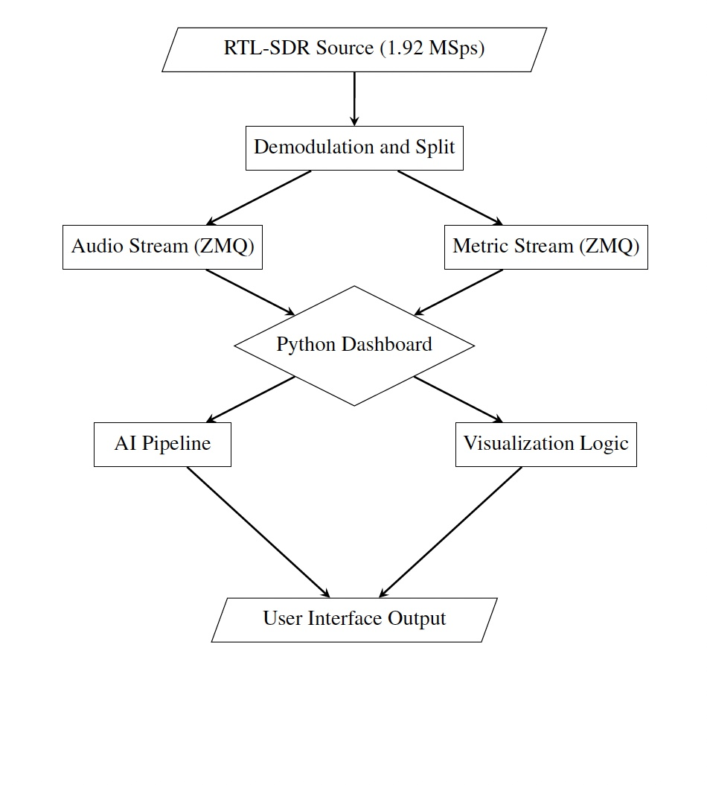
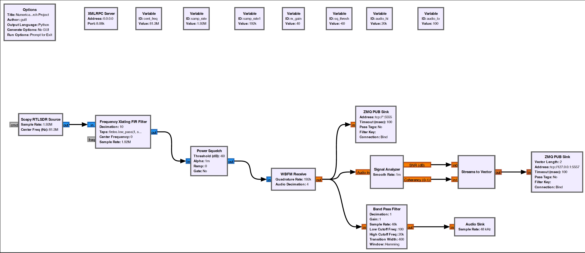
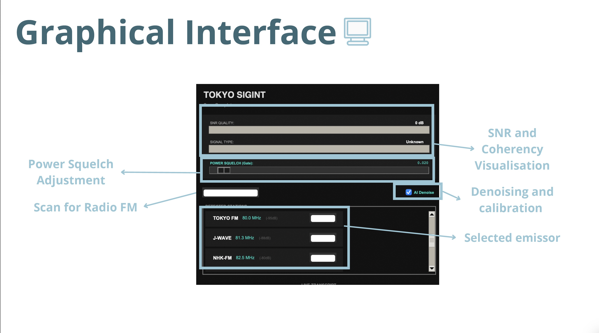
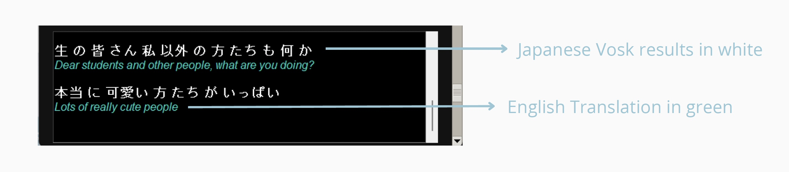

# 🗼 TOKYO SIGINT: Intelligent SDR Reception & AI Transcription System

A high-performance Software-Defined Radio (SDR) pipeline designed for real-time FM signal analysis, automated noise profiling, and live Japanese-to-English translation. Developed as a Research Project for a Signal Analysis course at Waseda University.

## 📡 Overview

Traditional FM receivers often struggle with static noise, low adaptability, and high false-positive rates when scanning for clear frequencies. **TOKYO SIGINT** addresses these challenges by integrating **Digital Signal Processing (DSP)** with **Deep Learning** to create an adaptive, "smart" radio environment. This system also helps translate foreign language radio.

### ✨ Core Capabilities

* **Intelligent Scanning**: Automatically detects active emitters across the FM band (76.0 – 95.5 MHz) using Welch’s Method for power spectral density estimation.

* **Custom OOT Signal Analyzer**: A GNU Radio Out-Of-Tree (OOT) block that calculates **Signal-to-Noise Ratio (SNR)** and **Coherency** (real-time autocorrelation) to classify signal stability.

* **Adaptive Noise Profiling**: Implements an ambient noise capture system that calculates real-time noise floors to adjust squelch thresholds dynamically, preventing incorrect voice cuts.

* **Live AI Translation**: Utilizes the offline **Vosk STT** engine for Japanese speech-to-text, followed by a multi-threaded **Google Translator** pipeline for real-time English subtitles.

## 🏗️ System Architecture
n
The system utilizes a modular hybrid architecture combining hardware, DSP, and Python-based AI orchestration communicating via ZeroMQ (ZMQ).

*Figure 1: High-level data flow from RF capture to AI UI output.*


### 1. The DSP Pipeline (GNU Radio)

Raw RF is captured by an **RTL-SDR V4** at 1.92 MSps, downconverted, Wideband FM (WBFM) demodulated, and then analyzed for signal metrics using the custom `nrp_signal_analyzer` block.

*Figure 2: Complete DSP system flowgraph visualized in GNU Radio Companion.*


### 2. Custom OOT Blocks (The "NRP" Module)

The custom **NRP (Numerical Research Project)** module contains the unique signal analysis logic built natively for GNU Radio:

* **Signal Analyzer**: Processes demodulated audio to derive SNR and Coherency values using auto-correlation.

* **Adaptive Noise Profiler**: Tracks the ambient noise floor using Hanning windowed FFTs to provide dynamic squelch control.

### 3. Application Layer & User Interface

A custom-built Python dashboard serves as the central control node. It subscribes to the ZMQ data streams from GNU Radio for both 16 kHz audio and real-time DSP metrics.

*Figure 3: Main Tkinter dashboard featuring live SNR/Coherency visualization, intelligent squelch tuning, and active emitter selection.*


## 🤖 AI Translation Engine

The system features an asynchronous AI pipeline designed to handle variable background noise. Original audio is downsampled and gated by the adaptive squelch before being fed into the **Vosk offline speech-to-text model**. A secondary thread pushes the Japanese transcriptions through the Google Translator API.

*Figure 4: Live console output showing original transcribed Japanese (white) and real-time English translation (green).*

## 📂 Repository Structure

```
.
├── Numerical Research Project.grc  # Primary GNU Radio flowgraph
├── dashboard.py                    # Main GUI, ZMQ subscriber, and AI orchestration
├── setup.sh                        # Automated build & install script
└── gr-nrp/                         # Custom OOT module source code
    ├── python/nrp/
    │   ├── signal_analyzer.py      # DSP logic for SNR/Coherency
    │   └── adaptive_noise_profiler.py
    └── grc/                        # GRC block definitions (.yml)

```

## 🚀 Getting Started

### Prerequisites

* **Hardware**: RTL-SDR V4 (or compatible receiver).

* **Software**: GNU Radio 3.10+, Python 3.8+, CMake.

* **Python Libraries**: `pyzmq`, `vosk`, `deep-translator`, `noisereduce`, `numpy`, `scipy`, `pyrtlsdr`.

### Installation & Run

1. **Install Dependencies & Build OOT Blocks**:

   ```
   chmod +x setup.sh
   ./setup.sh
   
   ```

2. **Download AI Model**: Download a Japanese Vosk model from [alphacephei.com/vosk](https://alphacephei.com/vosk/models) and extract it into a folder named `model/` in the root directory.

3. **Launch DSP Backend**: Open `Numerical Research Project.grc` in GNU Radio Companion and execute the flowgraph.

4. **Launch Dashboard**:

   ```
   python dashboard.py
   
   ```


*Developed by Sumanth Gopisetty*
